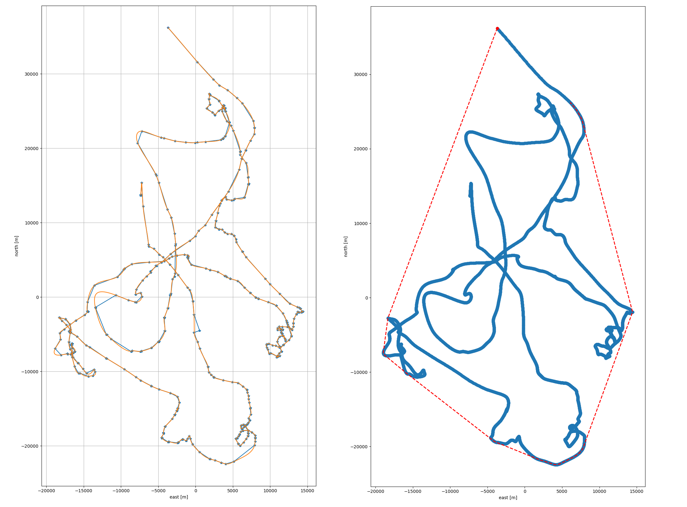

# snappergps-scripts

This repository contains a collection of Python scripts that use tracks downloaded from the SnapperGPS app as input and output various things:

| script | description |
|:--:|:--:|
| `track_length_polyline.py` | Calculate the length of a polyline through all valid fixes. |
| `gaussian_process_regression.py` | Smooth a track with Gaussian process regression, calculate the length of the smoothed track, write the smoothed track to a KML file and an animated KML file, calculate the area covered by the track. |
| `clean_csv.py` | Remove invalid fixes and the temperature and battery column from a CSV file.|
| `csv_to_kml.py` | Convert clean track from CSV to KML. |
| `smoothing.py` | Compare various filtering and smoothing approaches. Maybe they can serve as inspiration for your own post-processing scripts. |
| `plot_temperature.py` | Read a SnapperGPS JSON file and plot the temperature over time. |
| `csv_to_html.py` | Plot all SnapperGPS tracks in a folder on an HTML map. Map can be displayed in a web browser. |
| `trim_json.py` | Trim raw SnapperGPS data to a time interval. |

## Setup

You need a version of Python 3 on your machine.

Clone this repository with `git` or download the code.

If you have the `pip` package manager, you can install all required packages with `python -m pip install -r requirements.txt`

## Examples

### `gaussian_process_regression.py`

|  |
|:--:| 
| *Figure 1: Original SnapperGPS track of a sea turtle (left, blue) in comparison to version smoothed with Gaussian process regression (left, orange). The same track (right, blue) with the automatically calculated area covered by the turtle (right, red).* |

|  |
|:--:| 
| *Figure 2: Smoothed and animated SnapperGPS track of a sea turtle saved as KML file and displayed in Google Earth Pro.* |

### `smoothing.py`

|  |
|:--:| 
| *Figure 3: Raw high-frequency SnapperGPS track (pink), the same track smoothed with a Rauch-Tung-Striebel smoother (RTS, grey) or Gaussian process regression (GPR, purple), a ground-truth track from a commercial GNSS receiver using RTK (black).* |

### `plot_temperature.py`

|  |
|:--:| 
| *Figure 4: Temperature recorded with a SnapperGPS receiver over about five hours while cycling and walking.* |
